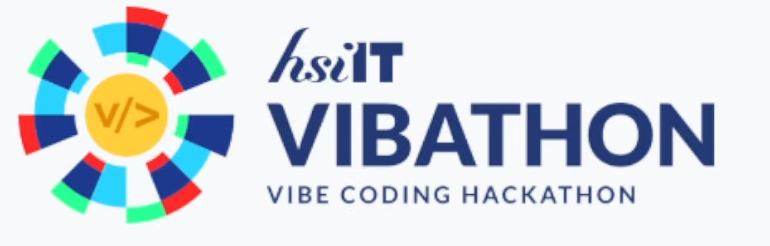

# 🌿 Dzikr & Dua | Muslim Media Player

Bismillah. A beautiful, distraction-free web application for listening to and reading morning, evening, and daily Adhkar. Designed with the **"Terra" (Organic/Grounded)** aesthetic to provide a peaceful, sanctuary-like experience for spiritual remembrance.

## 🏆 HSI-IT Vibathon


This project was developed as part of the **HSI-IT Vibathon** event organized by **HSI Abdullah Roy**. It aims to leverage modern web technology to make daily spiritual practices more accessible and engaging.

## 💬 Feedback
We value your thoughts! Please share your feedback, report bugs, or suggest features via our [Feedback Hub](https://fbdzikrdua.insanmustaqbal.or.id).

## ✨ Features

-   **Terra Design Philosophy**: An organic UI using Forest Green, Warm Cream, and Warm Amber, avoiding sterile blacks and whites.
-   **Dynamic Time-Based Routing**: Automatically suggests Morning or Evening Adhkar based on your local time.
-   **Dual Sidebar Layout**: Focused reading experience with secondary controls for queue management and search.
-   **Semantic Search**: Fast, client-side search across multiple languages (Arabic, English, Albanian) powered by **Orama**.
-   **Stateless Persistence**: Share your current queue and playback position via simple URL parameters (compressed with `lz-string`).
-   **Continuous Audio**: Seamless playback that persists across route transitions.

## 📱 Ecosystem

This web application is part of the broader **Dzikr & Dua** ecosystem. Check out the native mobile version:
-   [Dzikr & Dua Web](https://github.com/decaller/Dzikr-DuaWeb) (React / TanStack Start)
-   [Dzikr & Dua Mobile](https://github.com/decaller/DzikrAndDuaMobile) (Flutter)

## 🛠 Tech Stack

-   **Framework**: [TanStack Start](https://tanstack.com/start) (React + TypeScript + Vite)
-   **Routing**: [TanStack Router](https://tanstack.com/router)
-   **Styling**: [Tailwind CSS v4](https://tailwindcss.com/) + [shadcn/ui](https://ui.shadcn.com/)
-   **State Management**: [Zustand](https://docs.pmnd.rs/zustand/)
-   **Search Engine**: [Orama](https://oramasearch.com/)
-   **Animations**: [Framer Motion](https://www.framer.com/motion/)

## 🚀 Getting Started

### Prerequisites

-   **Node.js** (v18+)
-   **Bun** (Recommended) or NPM

### Installation

1.  **Clone the repository**:
    ```bash
    git clone https://github.com/decaller/Dzikr-DuaWeb.git
    cd Dzikr-DuaWeb/Dzikr&Dua
    ```

2.  **Install dependencies**:
    ```bash
    bun install
    ```

3.  **Run the development server**:
    ```bash
    bun dev
    ```

4.  **Build for production**:
    ```bash
    bun run build
    ```

## 📚 Data Sources & Credits

We are deeply grateful to the following sources for providing the datasets and inspiration:

1.  **[BetimShala/mburoja-api](https://github.com/BetimShala/mburoja-api)**: Core invocation data and audio files.
2.  **Radio Rodja**: Supplementary audio and educational content.
3.  **[Islamic Dua & Adhkar Dataset (Kaggle)](https://www.kaggle.com/code/ahsanneural/islamic-dua-adhkar/input)**: English titles and metadata enrichment.
4.  **[Hisn-Muslim-Json](https://github.com/wafaaelmaandy/Hisn-Muslim-Json)**: Authoritative English translations and chapter mappings.
5.  **[HisnMuslim.com](https://hisnmuslim.com/i/en/1)**: Comprehensive English source and documentation.

## 📜 License

This project is for educational and spiritual purposes. Please refer to the original data sources for their respective licensing terms.

---

*Alhamdulillah for the opportunity to build this. May it be a benefit to the Ummah.*
