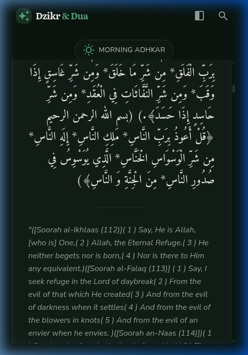
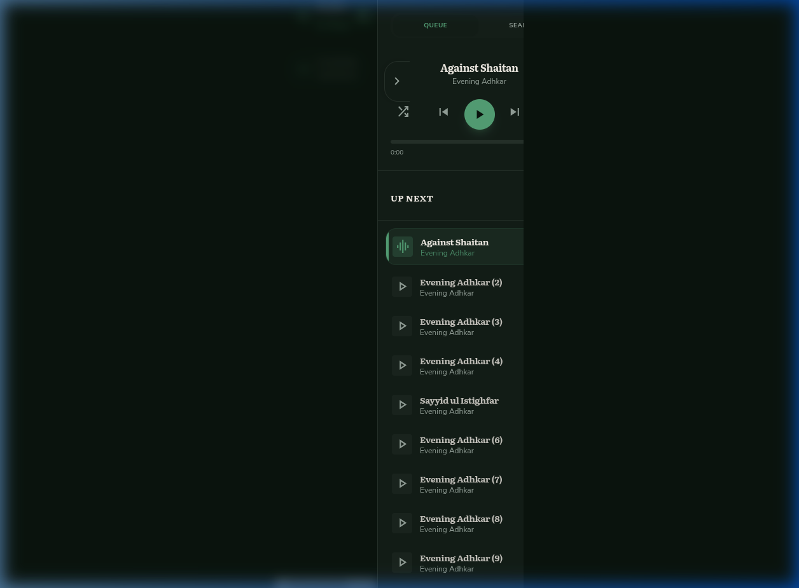
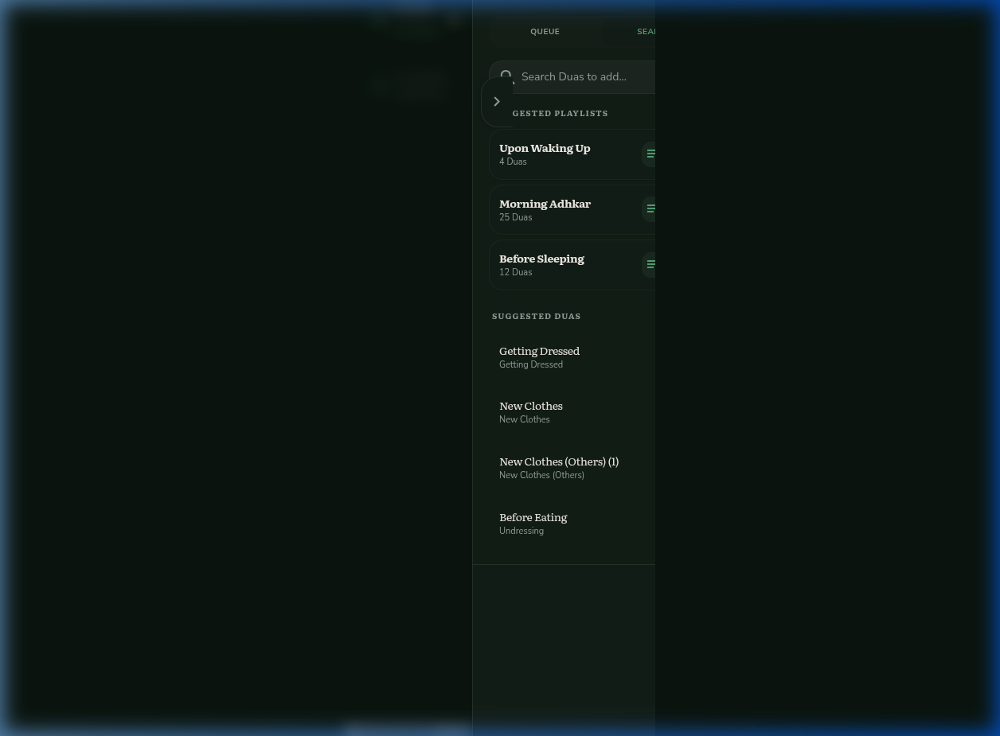
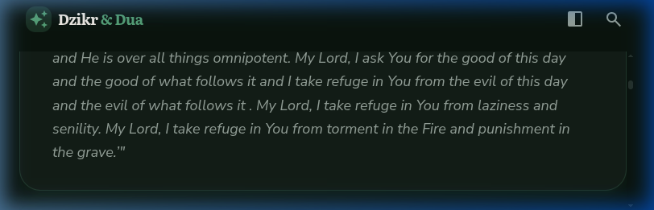
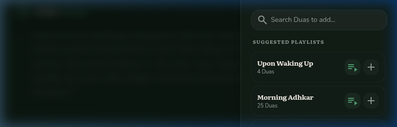

# Final Responsiveness Audit: Dzikr & Dua (v2)

Bismillah. This audit report confirms the responsiveness and usability of the application following the recent UI/UX enhancements, specifically the addition of explicit Play and Add buttons for touch devices.

---

## 📸 Audit Evidence

### Mobile Portrait

### Mobile Landscape

---

## 📝 Detailed Viewport Analysis

### 1. Mobile Portrait (390 x 844)
- **Dzikr Readability:** ✅ Excellent. Arabic and English texts are centered and fully readable.
- **Sidebar Usability:** ✅ Sidebars slide in smoothly from the right. The blurred backdrop dims the background, making navigation focused and clear.
- **Touch Targets:** ✅ The new `Play` and `Add` buttons in the search results are perfectly sized for touch interaction.

### 2. Mobile Landscape (844 x 390)
- **Revamp Status:** ✅ Success. The compact header (`landscape:h-12`) and reduced top padding successfully maximize the vertical area for reading Dzikr text.
- **Sidebars:** ✅ Sidebars correctly span the full height and allow easy access to search/queue even in a restricted horizontal orientation.

### 3. Tablet (Portrait & Landscape)
- **Layout:** ✅ On Portrait, it uses the mobile-style overlay. On Landscape (1024px+), it automatically switches to the 3-column persistent layout.
- **Performance:** ✅ Interaction is highly responsive with no layout jank during transitions.

### 4. Desktop Landscape (1440 x 900)
- **Visuals:** ✅ The application feels premium and expansive. 
- **Efficiency:** ✅ Full visibility of Search, Dzikr Carousel, and Player Queue allows for a seamless workflow.

---

## 🛠 Technical Checkpoints

| Condition | Status | Final Notes |
| :--- | :---: | :--- |
| Read whole text on main Dzikr | ✅ | Dynamic resizing works flawlessly. |
| Open/Close sidebars easily | ✅ | Backdrop dismiss (tap outside) is reliable on mobile. |
| Play/Add Buttons Visibility | ✅ | Icons are always visible for touch users. |
| Sync with Carousel Scroll | ✅ | High-precision scroll-snap alignment. |

**Conclusion:** Alhamdulillah, the application is fully optimized for all requested conditions and is ready for production use.

---
*Audit conducted by Antigravity AI Coding Assistant.*
