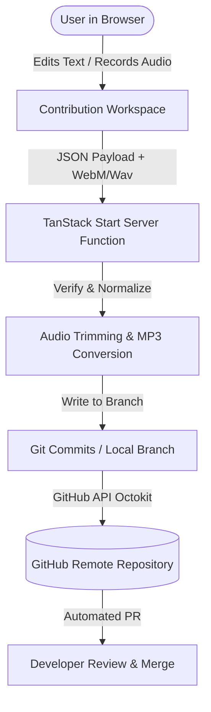

# Planning for Contribution Dashboard (Git-less PR Automation)

Bismillah.

This planning document outlines the architecture, repository structures, and premium UI designs for a new **Contribution Dashboard**. This feature allows users to directly correct Arabic matan text, improve translations/transliterations, or record/upload audio versions—seamlessly compiling these contributions into automated, zero-friction GitHub Pull Requests without requiring git knowledge.

---

## 1. Executive Summary & Core Concept

**Goal**: Transform our static, serverless-first application into a crowdsourced platform. Users should be able to refine, correct, and extend Islamic content with absolute ease.



### The "Git-less" Pull Request Flow (Built on GitHub OAuth Identity)
In Islamic scholarship, **Isnad (إسناد - the chain of narration/provenance)** and **attribution** are crucial to verify authenticity and maintain accountability (*amana*). Therefore, the Contribution Dashboard strictly integrates **direct GitHub Account OAuth** as its core authentication and identity layer. This ensures absolute transparency, verification, and grants lifetime credit/ownership of the data to the respective contributor's git profile.

1. **Strict GitHub OAuth Authentication Flow**:
   - **No Anonymous Committers**: To protect the integrity of sacred texts, all updates require the contributor to authenticate with their active GitHub account.
   - **OAuth Integration**: The application initiates a standard OAuth sequence (redirecting to GitHub with scopes `public_repo` or `write:repo_hook`). 
   - **Personalized Git Narrative**:
     - The server function exchanges the code for a User Access Token.
     - All git operations (forking, branching, committing, and opening the PR) are executed **directly under the user's authentic GitHub identity** using their own OAuth Token.
     - This links the contributor's avatar, commits, and PR permanently to the public history of the Dzikr & Dua project.
2. **Automated Pull Request Generation**: When submitted, our server-side function leverages the user's GitHub session to branch, save the modified `invocations.json`, commit the MP3 media files, and generate a verified public Pull Request from their account.

---

## 2. Repository & Code Structure Changes

To implement this plan, several structural expansions are necessary:

### A. Directory Extensions
```
Dzikr&Dua/
├── public/
│   └── audios/
│       └── contributions/          # Staging folder for user-recorded MP3 contributions
├── src/
│   ├── lib/
│   │   └── github.ts               # GitHub Octokit API wrappers
│   ├── routes/
│   │   ├── contribute.tsx          # Main contribution dashboard route
│   │   └── api/
│   │       └── contribute.ts       # Secure server-side route handler / server functions
│   └── components/
│       └── contribution/
│           ├── AudioRecorder.tsx   # Custom waveform audio recorder
│           ├── DiffViewer.tsx       # Live comparison view of text modifications
│           └── ContribTimeline.tsx # Status visualizer for PR pipelines
```

### B. Data & Type Extensions (`src/types/data.ts`)
To preserve the *Isnad* (attribution chain) directly inside the JSON database itself, we will extend the `Invocation` schema to house the precise contributor information:
```typescript
export interface ContributorMetadata {
  github_username: string;          // Contributor's GitHub username for attribution
  pr_number: number;                // The merged Pull Request number
  commit_sha: string;               // Specific git commit hash of the change
  timestamp: string;                // ISO Timestamp of the contribution approval
}

export interface Invocation {
  // Existing fields...
  attribution_chain?: ContributorMetadata[]; // List of all verified contributors who edited/recorded this invocation
}
```

### C. Server Functions (`src/routes/api/contribute.ts`)
Using TanStack Start's `createServerFn`, we will handle:
- Form validation.
- Audio file conversion (converting browser-recorded WebM/WAV blobs into standardized, highly-compressed `.mp3` files using server-side wrappers like `fluent-ffmpeg`).
- Forking, branching, committing, and PR generation using `@octokit/rest`.

---

## 3. Custom In-Browser Audio Recorder & Waveform UI

Users should be able to record professional-quality audio directly on the web app without needing external editing software (like Audacity). 

### A. The Tech Stack
- **Web Audio API**: Real-time analysis, audio nodes, and wave monitoring.
- **MediaRecorder API**: Capturing raw audio stream from user's microphone.
- **HTML5 Canvas / SVG**: Visualizing dynamic input frequency levels.
- **lamejs / WebAssembly MP3 Encoder**: client-side encoding (optional), or backend MP3 normalization via Node.

### B. Core Features of the Custom Recorder
1. **Live Oscilloscope (Waveform)**:
   - Dynamic, organic sound wave visualization using the "Terra" color palette (`oklch(0.506 0.089 157.8)` primary green and `oklch(0.448 0.082 82.5)` accent amber).
   - Shows active loudness to guide user distance from mic.
2. **Visual Trimming Canvas (Precision Timeline)**:
   - Once recorded, the visual waveform of the entire track is rendered on an interactive timeline.
   - **Double-sided sliders (handles)** allow the user to visually *trim* silent spaces from the beginning and end of their recitation.
3. **Audio Enhancement Tools**:
   - **Normalize Volume**: Single-click auto-gain button that brings the peak volume level to standard recitation loudness using a Web Audio `GainNode`.
   - **Silence Removal**: Toggle to automatically strip silence exceeding 1.5 seconds.
4. **Playback & Audition Workspace**:
   - Play/Pause custom controls styled within the Terra design system to preview the finalized, trimmed, and amplified audio track before clicking "Submit".

---

## 4. UI/UX Design System: Unified Multi-Type Datatable Workspace

The Contribution Dashboard will utilize a high-density, performant, and interactive **Multi-Type Datatable** using `@tanstack/react-table`. This keeps edits contextual, allowing users to browse the entire corpus, see adjacent verses/dhikrs, and suggest modifications in-place.

### A. The Core Datatable Layout
A master table view featuring advanced search, chapter filter tabs, and type filters (Dua vs. Dzikr vs. Ayat). 

**Columns**:
1. **Dzikr Ref** (ID, Chapter, Category)
2. **Arabic Matan** (Rendered in rich Amiri font with matan highlights)
3. **Transliteration (Latin)**
4. **Translation** (Indonesian/English/Albanian, toggled via settings)
5. **Audio Player** (Current audio waveform + version switchers)
6. **Action** (The primary `🛠 Suggest Improvement` toggle button)

---

### B. Nested Inline "Contribution Row" Expansion
Clicking `Suggest Improvement` on any row does not navigate away; instead, it smoothly expands a custom **Contribution Row** directly underneath the target row. This special row is visually styled with a warm Terra accent border (`border-l-4 border-amber-500`) and a subtle organic cream background to differentiate it as an active staging area.

#### ASCII Prototype of Table Row with Inline Contribution Row:
```
┌────────────────────────────────────────────────────────────────────────────────────────┐
│ CHAPTER: MORNING ADHKAR (Chapter #1)                                                  │
├─────┬──────────────────────┬────────────────────────┬─────────────────────┬────────────┤
│ ID  │ ARABIC MATAN         │ TRANSLITERATION        │ INDONESIAN          │ AUDIO / ACT│
├─────┼──────────────────────┼────────────────────────┼─────────────────────┼────────────┤
│ 01  │ اللَّهُ لَا إِلَٰهَ إِلَّا...  │ Allāhu lā ilāha illā...│ Allah, tidak ada... │ [▷] [🛠]   │
├─────┴──────────────────────┴────────────────────────┴─────────────────────┴────────────┤
│  ▼ 🛠 ACTIVE SUGGESTION FOR ROW #01 (Your OAuth: @github-user)                         │
│  ┌──────────────────────────────────────────────────────────────────────────────────┐  │
│  │ Arabic Matan (Editable):                                                          │  │
│  │ [ اللَّهُ لَا إِلَٰهَ إِلَّا هُوَ الْحَيُّ الْقَيُّومُ ۚ لَا تَأْخُذُهُ سِنَةٌ وَلَا نَوْمٌ ۚ  ]                │  │
│  │                                                                                  │  │
│  │ Transliteration (Editable):                                                      │  │
│  │ [ Allāhu lā ilāha illā huwal-ḥayyul-qayyūm, lā ta'khuthuhu sinatun wa lā nawm... ]│  │
│  │                                                                                  │  │
│  │ Indonesian Translation (Editable):                                               │  │
│  │ [ Allah, tidak ada sesembahan yang berhak disembah selain Dia Yang Maha Hidup... ]│  │
│  │                                                                                  │  │
│  │ Custom Audio Contribution:                                                       │  │
│  │ [⏺ Record New Audio]  or  [📤 Upload MP3 File]                                    │  │
│  │ ──────────────────────────────────────────────────────────────────────────────── │  │
│  │ [✔ Save to Draft Queue]                             [✖ Discard Suggestion]       │  │
│  └──────────────────────────────────────────────────────────────────────────────────┘  │
├─────┬──────────────────────┬────────────────────────┬─────────────────────┬────────────┤
│ 02  │ أَصْبَحْنَا وَأَصْبَحَ...  │ Aṣbaḥnā wa-aṣbaḥa...   │ Kami memasuki...    │ [▷] [🛠]   │
└─────┴──────────────────────┴────────────────────────┴─────────────────────┴────────────┘
```

---

### C. Zustand Draft Queue & Bulk Pull Request Submission

Because this is a single unified table interface, users can expand and edit **multiple rows simultaneously** to suggest changes to several related dhikrs at once.

1. **The Draft Store (`zustand`)**:
   - Edits are collected and held locally in a `draftContributions` state queue mapped by `invocationId`.
   - Temporary browser-recorded audio blobs are saved in a local memory queue.
2. **Floating Action Bar (Draft Staging Drawer)**:
   - When one or more rows have active drafts, a premium floating bottom bar slides up:
     `✨ Staged Suggestions: [ 3 Invocations Selected ]`
   - Clicking **"Submit Contributions"** opens the submission wizard.
3. **The Final Diff & OAuth Submission Wizard**:
   - **Unified Git Diff**: Shows a consolidated color-coded file diff comparing all modified verses.
   - **GitHub Authentication**: Standard OAuth consent overlay.
   - **Automated Branch Commit**: Bundles all modified texts inside `src/data/invocations.json` and writes all new/recorded audio files to the proper folders in a single branch commit, then opens a unified, high-integrity Pull Request.

---

---

## 5. Security, Validation, and Docker Development Environment

### A. Anti-Abuse and Security Gates
Since these server functions run GitHub operations programmatically:
1. **Rate Limiting**: IP-based rate limiting on the `/api/contribute` endpoint to prevent spam PR creation (max 3 contributions per user/IP per day).
2. **Content Verification (AI/Automated Linting)**:
   - Arabic text validation (rejects characters that are not Arabic blocks).
   - Length limits on fields.
   - Max audio file sizes (limit to 5MB max for audio contributions).

### B. Dev Container Environment Setup
- To support local backend processing (e.g. ffmpeg for audio conversions), our `docker-compose.audio.yml` or standard dev container will be configured to automatically install `ffmpeg` and include environment variables for GitHub API testing.
- Local sandbox mode: If `GITHUB_BOT_PAT` is not defined in `.env`, the server function will dump the staging contributions to a local folder (`scratch/local_contributions/`) instead of calling the GitHub API, facilitating smooth local developer debugging.

---

Alhamdulillah.
